| [Home](../README.md) |
|----------------------|

# Usage

## Technical Overview of MITRE ATT&CK Alerts and Incident Spread in FortiSOAR

FortiSOAR&trade;'s **MITRE ATT&CK Alerts and Incident Spread** widget offers a comprehensive view of security threats using the MITRE ATT&CK framework. Here's a breakdown of its key features:

**1. Tactics Overview:**

- The top row displays **MITRE ATT&CK Tactics** present in your FortiSOAR environment.
- Visible tactics depend on:
    - **Ingested MITRE ATT&CK Matrices:** Which attack frameworks are used?
    - **Widget filters:** Are *Hide Empty Tactics* and *Hide Tactics If All Related Techniques Are Hidden* enabled?

**2. Techniques and Subtechniques:**

- **Technique rows:**
    - Display technique names and links.
    - Show if techniques have **linked Subtechniques, Alerts, or Incidents**.
    - Clicking links expands the cell for details.
- **Subtechnique rows:**
    - Similar to Techniques, but can have their own linked Alerts and Incidents.
    - Clicking links expands the cell further for Alert and Incident details.

**3. Alerts and Incidents:**

- **Alert and Incident names** are displayed with **severity information**.
- **Heatmap filter** (if enabled) highlights all Alerts and Incidents for immediate attention.
- Clicking on these links opens the respective Alert or Incident details in FortiSOAR.

**Overall, this widget provides a valuable insight into:**

- **Potential attack vectors:** Which MITRE ATT&CK Tactics are present in your environment?
- **Specific techniques and subtechniques used:** Get details about individual attack steps.
- **Alerts and incidents triggered:** Identify potential threats and their severity.
- **Heatmap visualization:** Quickly prioritize critical issues.

This information equips security analysts with a **structured and actionable view** of threats, enabling them to **efficiently prioritize and respond** to security incidents.

## Mitre ATT&CK Alert/Incident Spread

1. Edit a *Dashboard*'s view template and select the **Add Widget** button.

2. Select **MITRE ATT&CK Alert Incident Spread** from the list to bring up the **MITRE ATT&CK Alert Incident Spread** widget's edit view.

3. Specify the title of the spread in the **Title** field.

    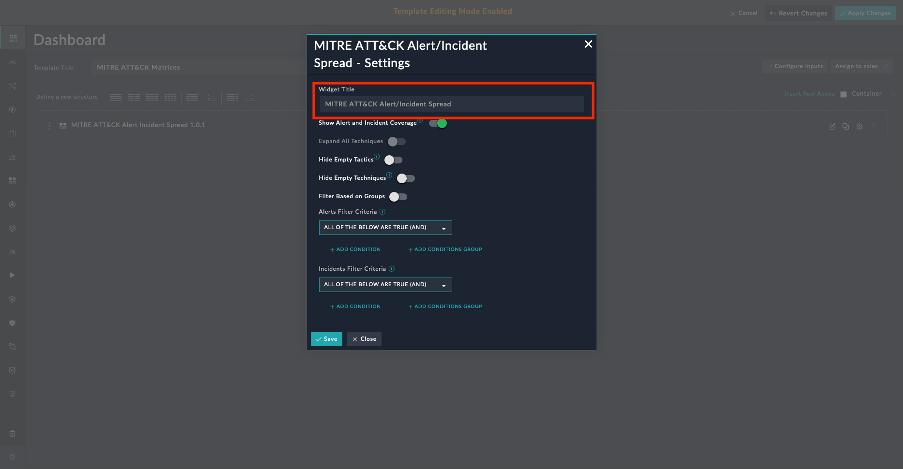

4. Select to toggle **Show Alert and Incident Coverage** to highlight and expand Techniques and Subtechniques. Only the techniques and subtechniques linked to alerts and incidents are displayed.

    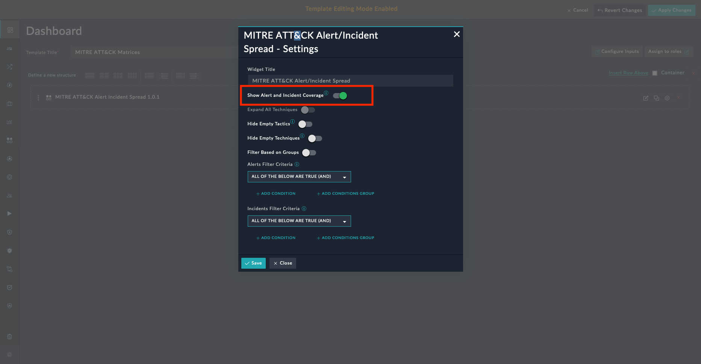

5. Select to toggle **Expand All Techniques** to highlight and expand all Techniques. This toggle is available only when *Show Alert and Incident Coverage* is off.

    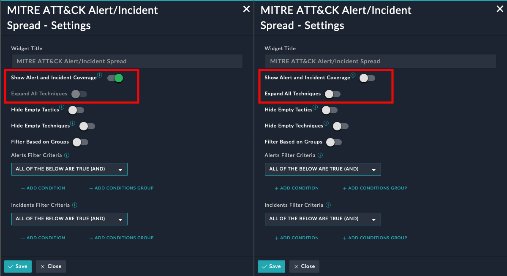

6. Select to toggle **Hide Empty Tactics** to hide tactics without any Technique relationships.

    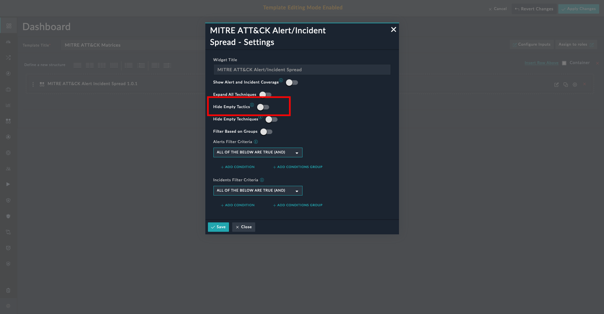

7. Select to toggle **Hide Empty Techniques** to hide Techniques without any Subtechnique, Alert, or Incident relationships.

    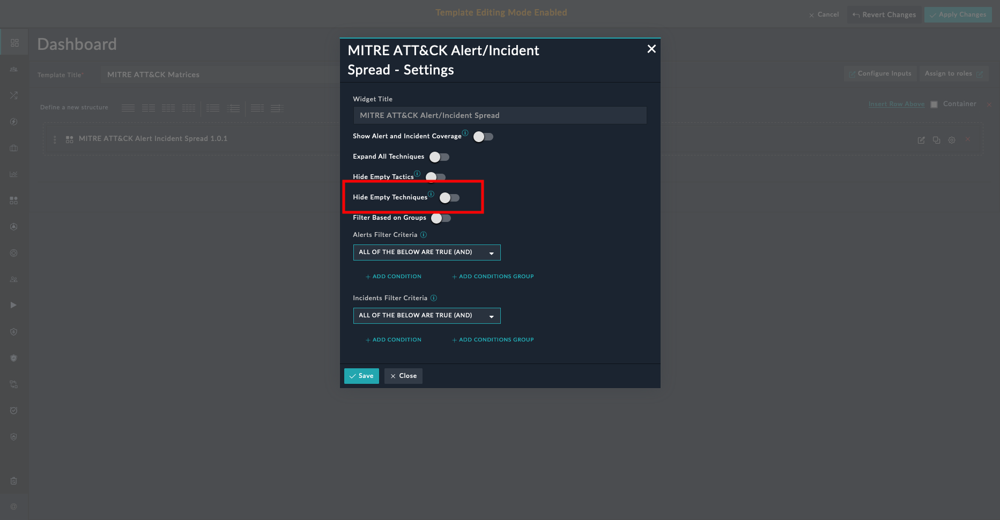

8. Select to toggle **Filter Based on Groups** and select threat actor groups to filter the Mitre ATT&CK spread.

    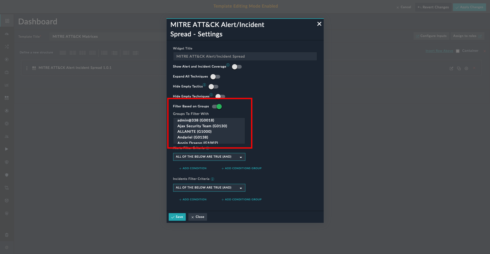

9. Define the filter criteria using which to hide alerts from being rendered by this widget.

    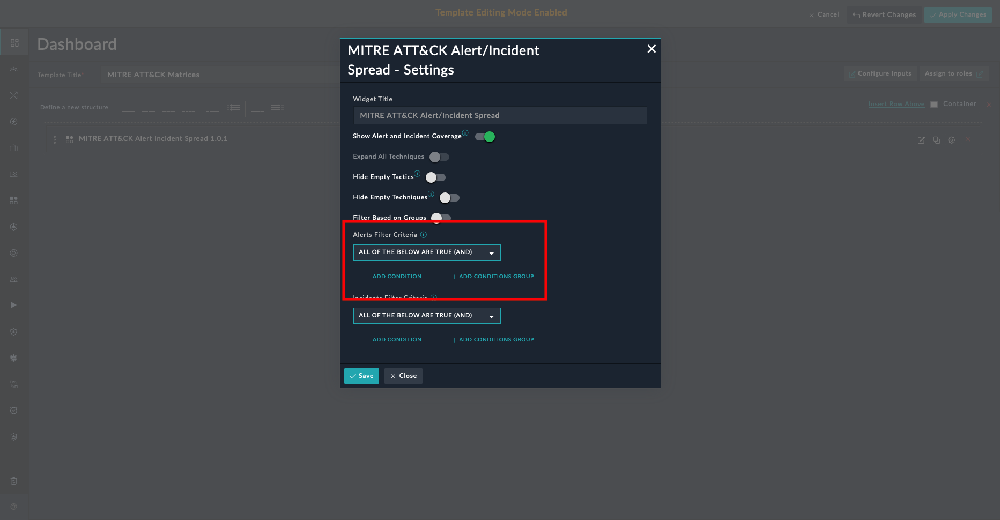

10. Define the filter criteria using which to hide incidents from being rendered by this widget.

    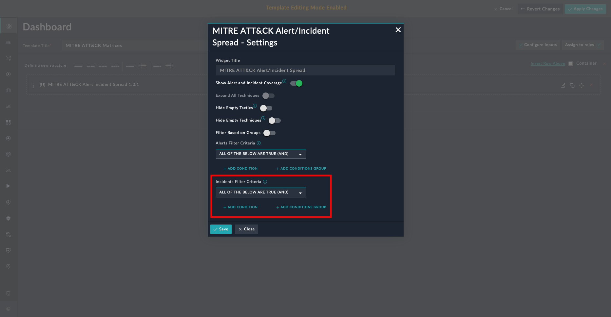

11. Click **Save** to save the changes and exit widget's edit view.

### MITRE ATT&CK Alert Incident Spread Widget Edit View

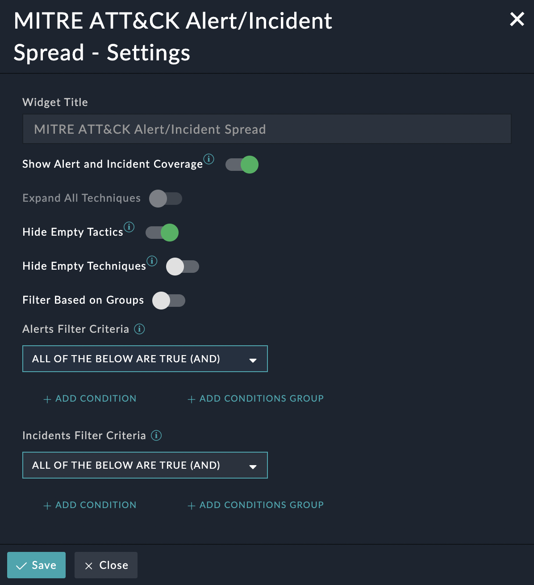"

### MITRE ATT&CK Alert Incident Spread Widget - Dashboard View

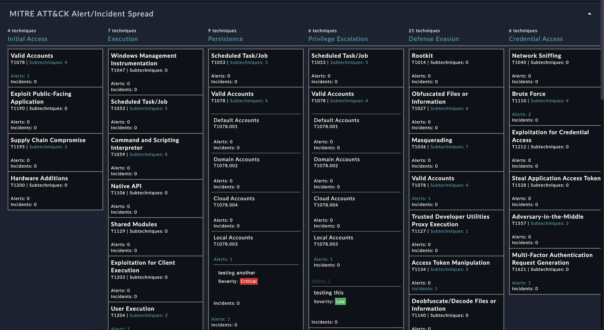

### MITRE ATT&CK Alert Incident Spread Widget - Dashboard View with Alert and Incident Coverage

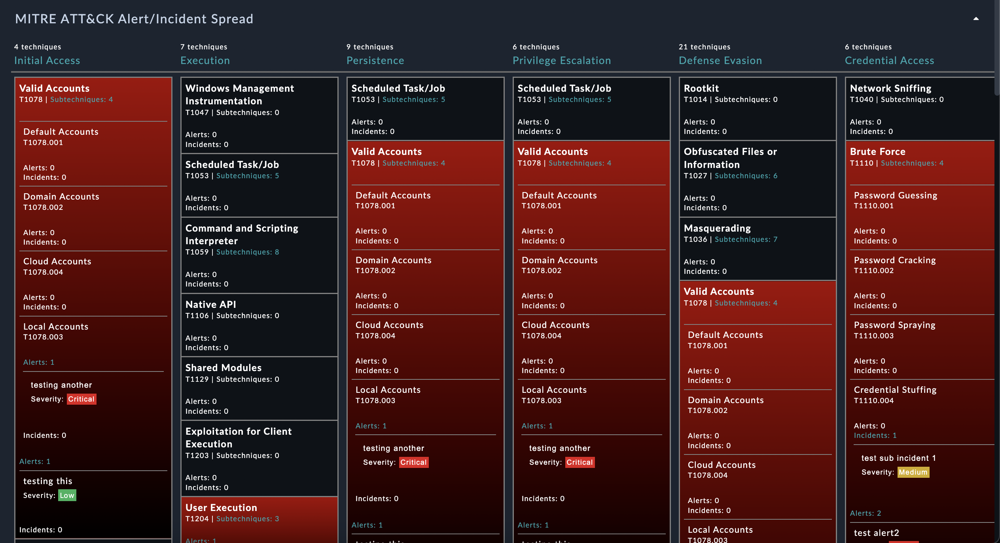

### MITRE ATT&CK Alert Incident Spread Widget - Detail View

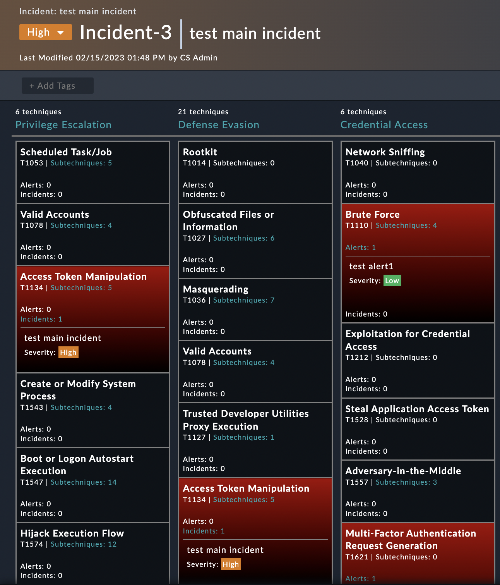

## Next Steps

| [Installation](./setup.md#installation) | [Configuration](./setup.md#configuration) |
|-----------------------------------------|-------------------------------------------|
