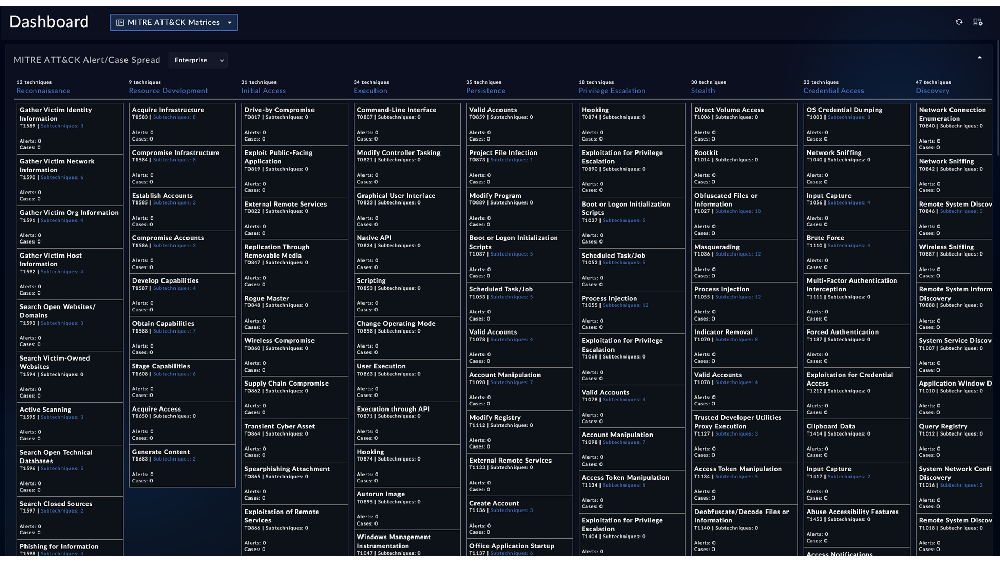
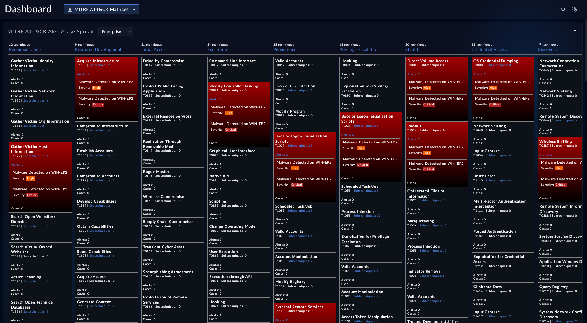
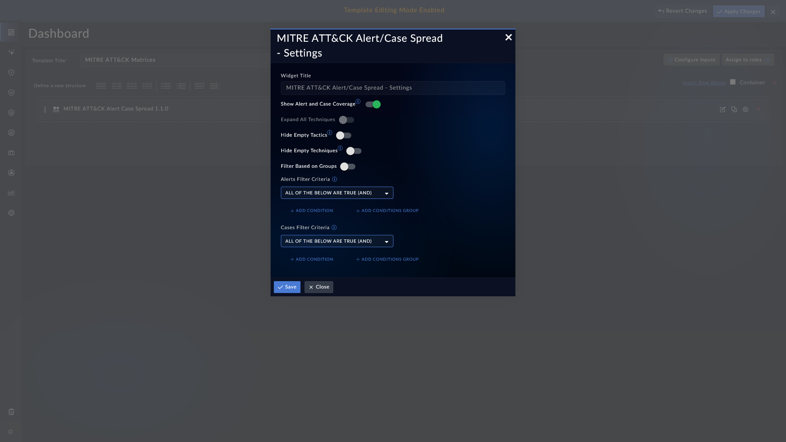

| [Home](../README.md) |
|----------------------|

# Usage

FortiSOAR&trade;'s **MITRE ATT&CK Alerts and Case Spread** widget offers a comprehensive view of security threats using the MITRE ATT&CK framework. Here's a breakdown of its key features:

## Tactics Overview

- The top row displays **MITRE ATT&CK Tactics** present in your FortiSOAR environment.
- Visible tactics depend on:
    - **Ingested MITRE ATT&CK Matrices:** Which attack frameworks are used?
    - **Widget filters:** Are *Hide Empty Tactics* and *Hide Tactics If All Related Techniques Are Hidden* enabled?

## Techniques and Subtechniques

- **Technique rows:**
    - Display technique names and links.
    - Show if techniques have **linked Subtechniques, Alerts, or Cases**.
    - Clicking links expands the cell for details.

- **Subtechnique rows:**
    - Similar to Techniques, but can have their own linked Alerts and Cases.
    - Clicking links expands the cell further for Alert and Case details.

**3. Alerts and Cases:**

- **Alert and Case names** are displayed with **severity information**.
- **Heatmap filter** (if enabled) highlights all Alerts and Cases for immediate attention.
- Clicking on these links opens the respective Alert or Case details in FortiSOAR.

**Overall, this widget provides a valuable insight into:**

- **Potential attack vectors:** Which MITRE ATT&CK Tactics are present in your environment?
- **Specific techniques and subtechniques used:** Get details about individual attack steps.
- **Alerts and Cases triggered:** Identify potential threats and their severity.
- **Heatmap visualization:** Quickly prioritize critical issues.

This information equips security analysts with a **structured and actionable view** of threats, enabling them to **efficiently prioritize and respond** to security incidents.

## MITRE ATT&CK Alert Case Spread Widget - Dashboard View

## MITRE ATT&CK Alert Case Spread Widget - Dashboard View with Alert and Case Coverage

## Editing the Mitre ATT&CK Alert/Case Spread Widget

1. Edit a *Dashboard*'s view template and select the **Add Widget** button. As an example, consider the **MITRE ATT&CK Matrices** dashboard.

2. Select **MITRE ATT&CK Alert Case Spread** from the list to bring up the **MITRE ATT&CK Alert Case Spread** widget's edit view.

3. Specify the title of the spread in the **Title** field.

4. Select to toggle **Show Alert and Case Coverage** to highlight and expand Techniques and Subtechniques. Only the techniques and subtechniques linked to alerts and cases are displayed.

5. Select to toggle **Expand All Techniques** to highlight and expand all Techniques. This toggle is available only when *Show Alert and Case Coverage* is off.

6. Select to toggle **Hide Empty Tactics** to hide tactics without any Technique relationships.

7. Select to toggle **Hide Empty Techniques** to hide Techniques without any Subtechnique, Alert, or Case relationships.

8. Select to toggle **Filter Based on Groups** and select threat actor groups to filter the Mitre ATT&CK spread.

9. Define the filter criteria using which to hide alerts from being rendered by this widget.

10. Define the filter criteria using which to hide the cases from being rendered by this widget.

11. Click **Save** to save the changes and exit widget's edit view.

## Next Steps

| [Installation](./setup.md#installation) | [Configuration](./setup.md#configuration) |
|-----------------------------------------|-------------------------------------------|
